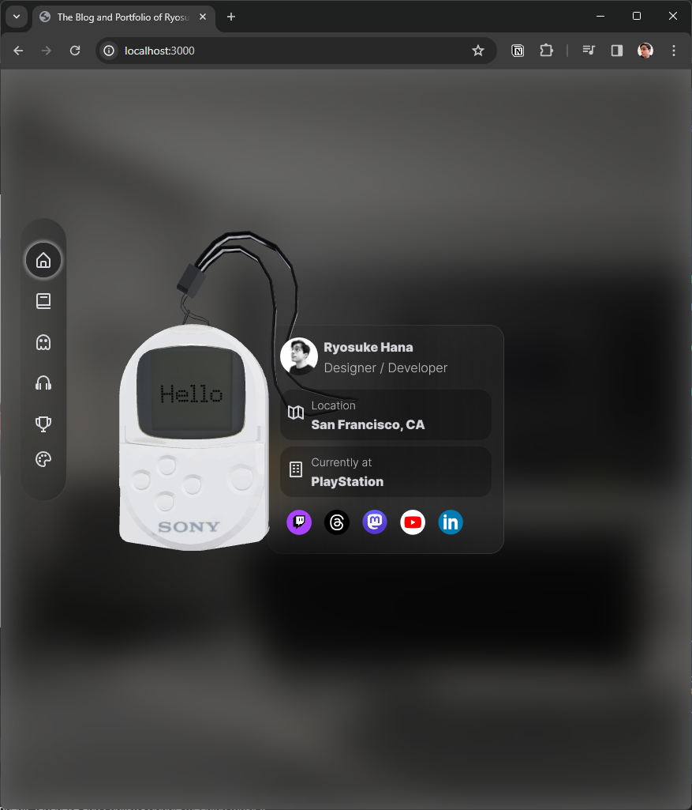
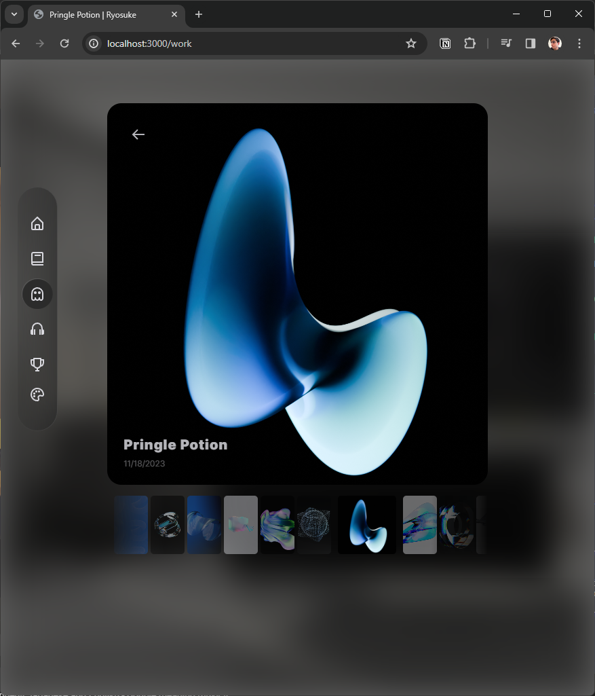

# Ryosuke's Blog

Redesigned in 2023, this is the personal blog and portfolio of Ryosuke Hana.

## Features

- ⚛️ ReactJS
- 🔺 NextJS
- ✏️ MDX
- 🪟 Focus management
- 🎮 Gamepad support
- 🌈 Styled Components + System
- 🎥 Custom video player
- 📦 3D using ThreeJS + R3F
- 🧑‍🎨 Visualizations using P5.js
- 🐇 Animation using framer-motion + react-spring

## Getting started

1. Clone repo.
1. `yarn`
1. `yarn dev`

## Notes

### MDX content

MDX content is stored in `/content/blog` folder and separated by the year of publication.

The content is queried by `/pages/blog/index.ts` for the blog archive and `[slug].ts` for each individual blog page.

> But if you want to use P5.js, you need to place the MDX file inside `/pages/blog/` and copy the existing template. Make sure to include frontmatter and a variable that exports the frontmatter data.

### Conditional custom components

When using `next-mdx-remote`, you can pass custom components to the MDX renderer. However, some pages/MDX files might use components that are used infrequently, or only on a single page. To avoid loading those components on every MDX page, you can use `next/dynamic` to conditionally load them.

For example, here's how you can change `getStaticProps` to pass a list of component names, checking the names in the page render function to see which components need to be dynamically loaded.

```js
import dynamic from "next/dynamic";
import Test from "../components/test";

const SomeHeavyComponent = dynamic(() => import("SomeHeavyComponent"));

const defaultComponents = { Test };

export function SomePage({ mdxSource, componentNames }) {
  const components = {
    ...defaultComponents,
    SomeHeavyComponent: componentNames.includes("SomeHeavyComponent")
      ? SomeHeavyComponent
      : null,
  };

  return <MDXRemote {...mdxSource} components={components} />;
}

export async function getStaticProps() {
  const source = `---
  title: Conditional custom components
  ---

  Some **mdx** text, with a default component <Test name={title}/> and a Heavy component <SomeHeavyComponent />
  `;

  const { content, data } = matter(source);

  const componentNames = [
    /<SomeHeavyComponent/.test(content) ? "SomeHeavyComponent" : null,
  ].filter(Boolean);

  const mdxSource = await serialize(content);

  return {
    props: {
      mdxSource,
      componentNames,
    },
  };
}
```
